# || Wajih Nahle || Ethan Wagstaff ||

## Personal Attack Wajih

**Date:** 12/4/25  
**Target:** https://pizza.nazgul.click  
**Classification:** Authentication Failure  
**Severity:** 3  
**Description:** Logged in as admin using an empty password.  
**Images:**
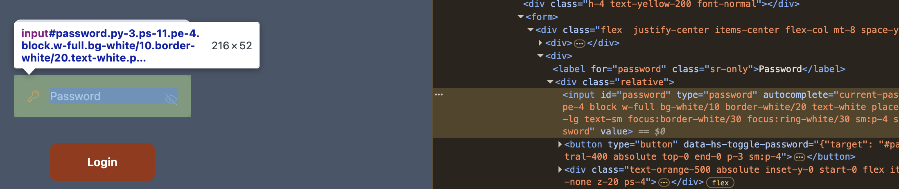
**Corrections:** Require non-empty passwords and validate credentials server-side.

**Date:** 12/4/25  
**Target:** https://pizza.nazgul.click  
**Classification:** Broken Access Control  
**Severity:** 2  
**Description:** Using a custom curl script I created fake pizzas and a store called HELL.  
**Images:**
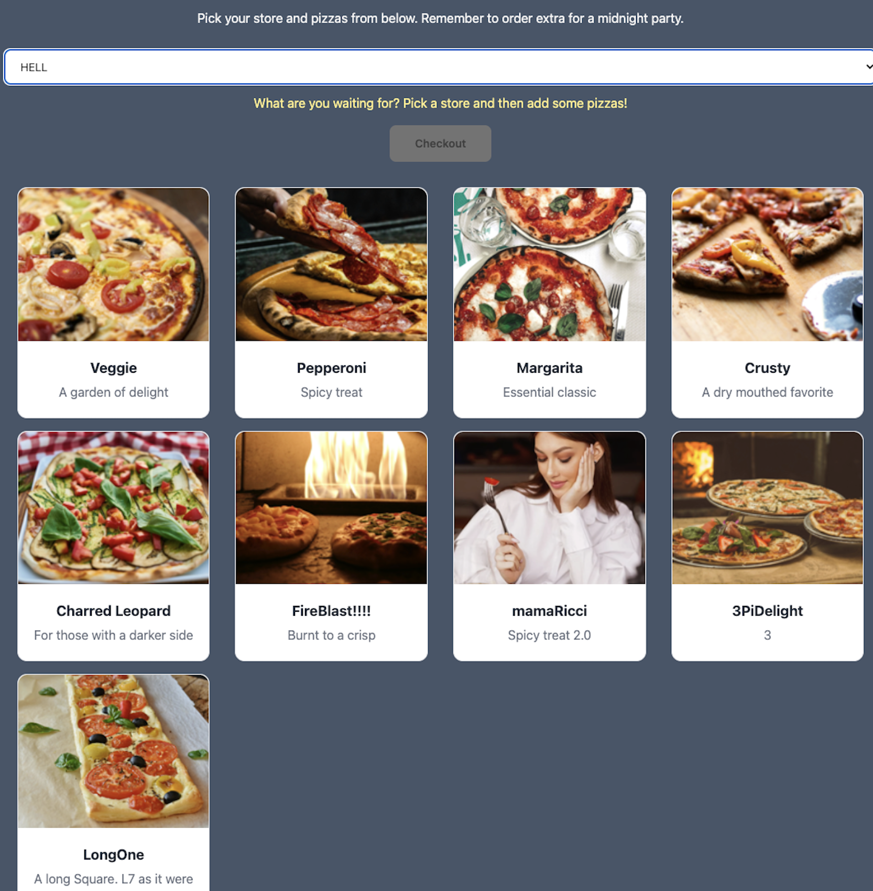
**Corrections:** Validate inputs and restrict creation actions to authorized users.

**Date:** 12/4/25  
**Target:** https://pizza.nazgul.click  
**Classification:** Broken Access Control  
**Severity:** 3  
**Description:** As the admin I deleted the store SLC, stopping pizzas from being ordered.  
**Images:**
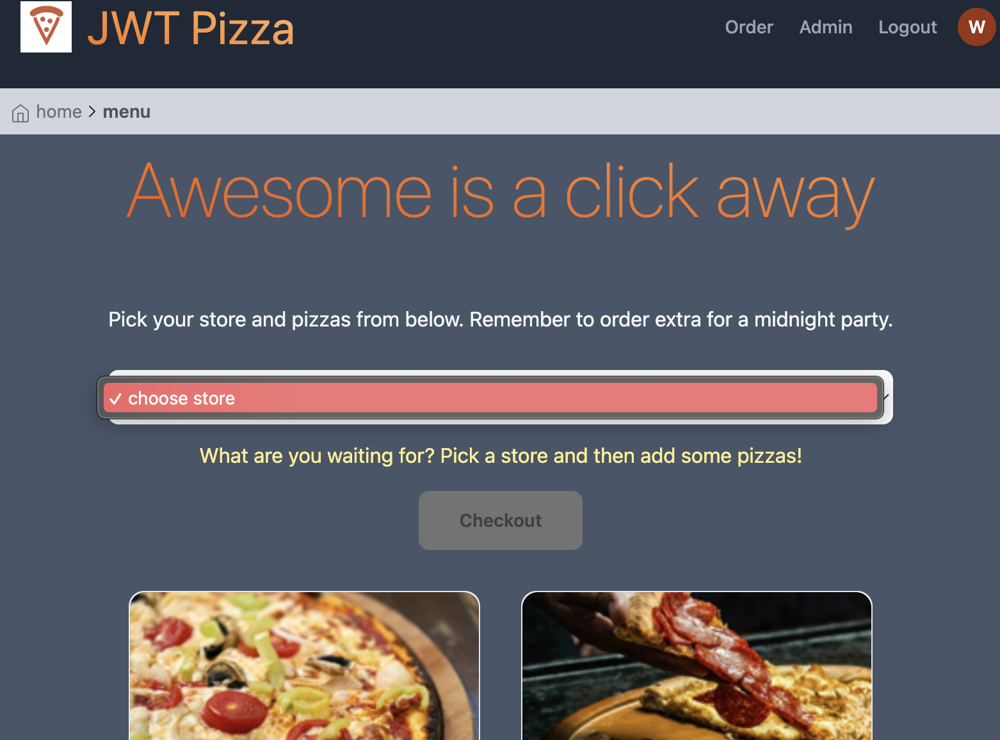
**Corrections:** Add safeguards for critical admin actions and require confirmation for store deletion.

## Personal Attack Ethan

**Date:** 12/4/25  
**Target:** https://pizza.nazgul.click  
**Classification:** Broken Access Control  
**Severity:** 5  
**Description:** I could delete all franchisees as a diner user by modifying the API request. The system did not validate the user’s authorization.  
**Images:**

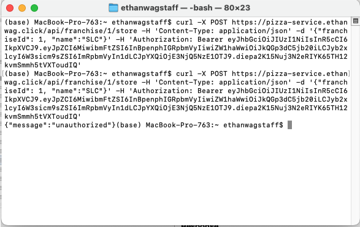

**Corrections:** Validate that the user deleting stores is the franchisee who owns those stores.

**Date:** 12/4/25  
**Target:** https://pizza.nazgul.click  
**Classification:** Insecure Design  
**Severity:** 4  
**Description:** When ordering pizzas, I was able to change my own prices, allowing me to get free pizzas.  
**Images:**

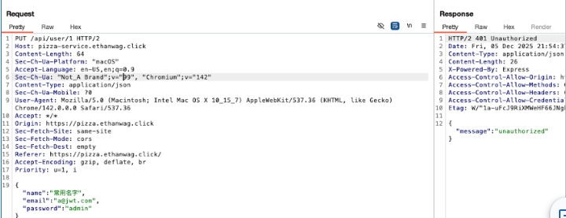

**Corrections:** Do not allow the client to control pricing values in requests.

**Date:** 12/5/25  
**Target:** https://pizza-service.nazgul.click  
**Classification:** Enumeration Attempt  
**Severity:** 2  
**Description:** I attempted again to retrieve the list of franchisees and obtain franchise IDs by directly attacking the backend server. Although unauthorized and unsuccessful, I confirmed the backend is running at pizza-service.nazgul.click.  
**Images:**

**Corrections:** For this project, there is little to change, but in the future, make backend services harder to discover or access directly.

## Partner Attacker Wajih --> Ethan

**Date:** 12/4/25  
**Target:** https://pizza.ethanwag.click  
**Classification:** Authentication Failure  
**Severity:** 2  
**Description:** Updated the admin by changing the email and password.  
**Images:**

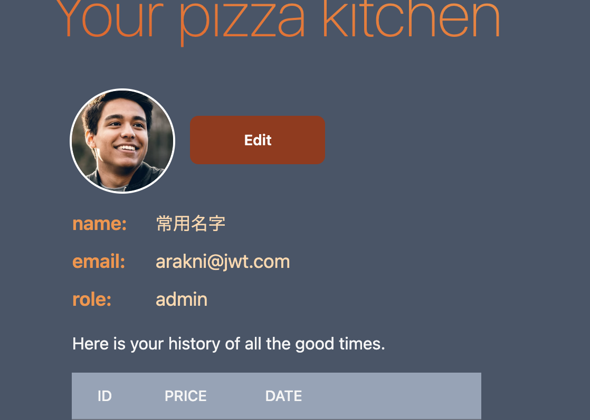

**Corrections:** Change default password.

**Date:** 12/4/25  
**Target:** https://pizza.ethanwag.click  
**Classification:** Broken Access Control  
**Severity:** 2  
**Description:** Using the admin I created fake pizzas and a fake store via my same curl script.  
**Images:**

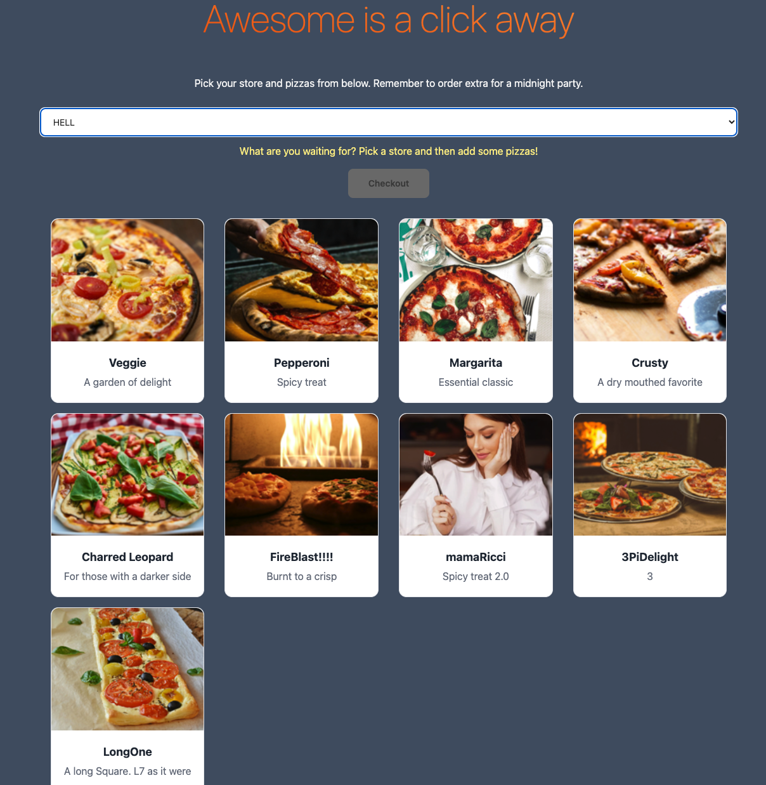

**Corrections:** Restrict admin creation actions and validate inputs.

**Date:** 12/4/25  
**Target:** https://pizza.ethanwag.click  
**Classification:** Broken Access Control  
**Severity:** 3  
**Description:** Updated the franchisee account by changing the email and password, then deleted all stores.  
**Images:**

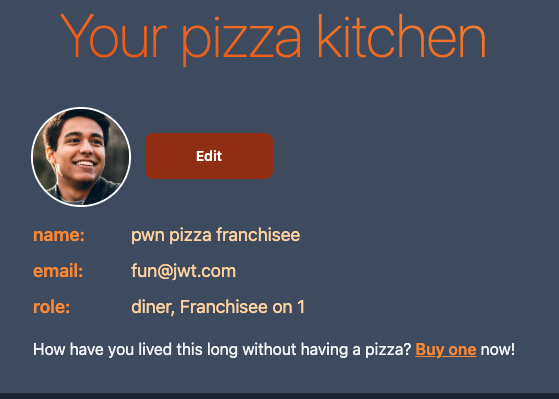 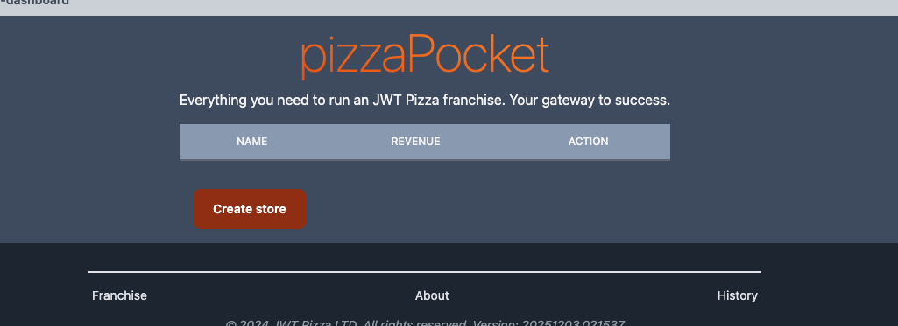

**Corrections:** Add stronger authorization checks and restrict destructive actions.

## Partner Attacker Ethan --> Wajih

**Date:** 12/5/25  
**Target:** https://pizza.ethanwag.click  
**Classification:** Authorization Check Success  
**Severity:** 3  
**Description:** I wanted to see if I could create a store by hitting the endpoint that allows a user to create a store. I attempted the attack using only a diner authToken instead of a franchisee one. The system correctly rejected the request with an unauthorized message.  
**Images:**

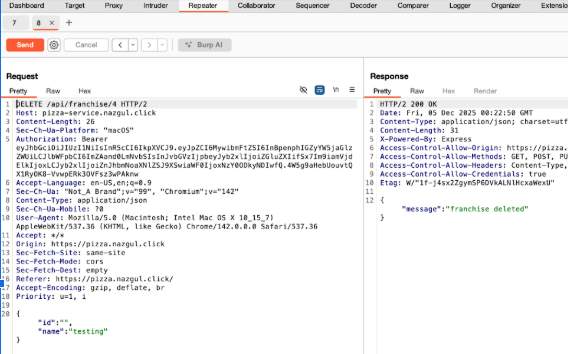

**Corrections:** This endpoint works well. Ensure all other endpoints likewise verify that the authToken belongs to a user with the correct role.

**Date:** 12/5/25  
**Target:** https://pizza.ethanwag.click  
**Classification:** Broken Access Control  
**Severity:** 5  
**Description:** For my attack, I attempted to change the admin password by entering the user ID and updating the password.  
**Images:**

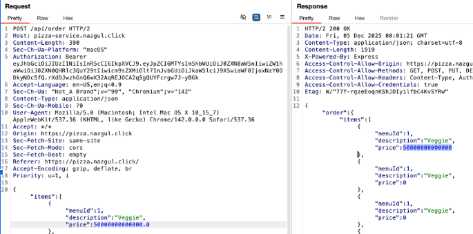

**Corrections:** I was unsuccessful in changing the admin password, so no corrective action was needed.

**Date:** 12/5/25  
**Target:** https://pizza-service.ethanwag.click  
**Classification:** Access to Private Information  
**Severity:** 2  
**Description:** An exposed endpoint returns a list of all franchisees in the system, including their names and user IDs. This information could be used to impersonate users.  
**Images:**

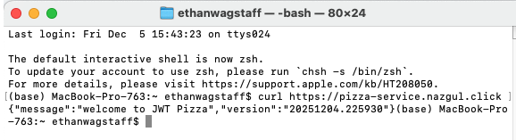 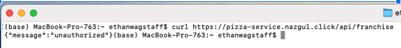

**Corrections:** Do not return private information such as user IDs; they should remain internal to the database.

## Summary

**Wajih**

I learned that I still love pentesting and find offensive security really fun. I did not realize just how vulnerable the website was. I think it was due to not having a complete grasp of everything every technology we were using could do and what it meant from a security standpoint.

I loved learning that you can alter code in the browser inspector and that Burp Suite is the same thing but on steroids. I definitely saw just how important changing default passwords is. Once intruders are in your system it can mean the end of your software depending on how open you let it. Security is definitely important and should be taken seriously.

**Ethan**

I learned how much developers must consider when building secure applications. Stepping back and looking at all possible attack vectors, I realized how much information can be exposed through basic GET requests. For example, calling the `GET /api/franchise` endpoint revealed all franchisee userIds—a major issue that could allow impersonation.

I also learned that the frontend should not control critical information, such as pizza prices. I demonstrated that modifying client-side values allowed me to set prices from zero to billions of bitcoins.

Overall, during my experiments, I saw that when designing API endpoints, you must make sure they are secure and do not reveal unnecessary details about the backend.
